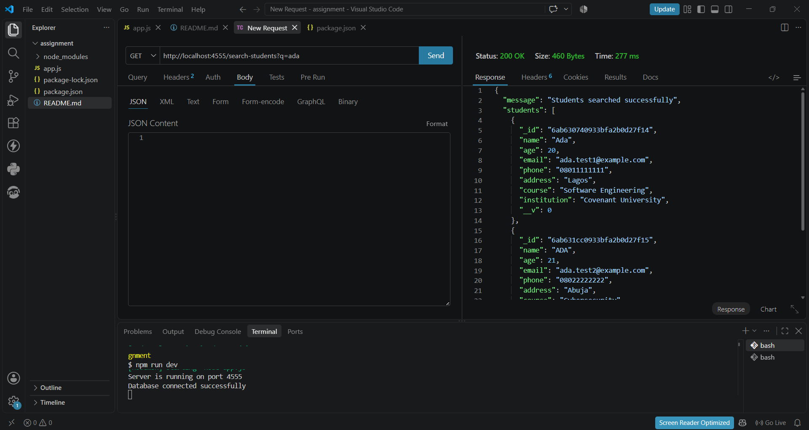
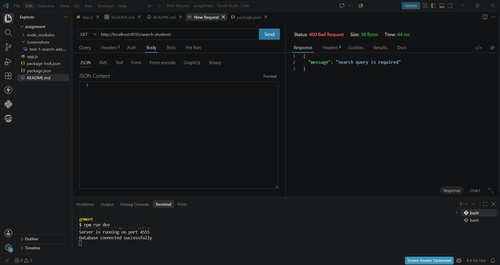

# Student Challenge: The "Ghost Student" Incident

A backend API built with Node.js, Express.js, and MongoDB/Mongoose to manage student records and handle common API and database edge cases.

## Part A : Written Answers

### 1. GET /get-student-by-name?name=Ada

The route uses:

const student = await Student.find({ name });

find() returns an array of all documents that match the condition. Therefore, if there are two students named Ada, both students will be returned inside one array.

For example, if there are two students named Ada, the response will contain both students in an array.

If findOne() were used instead:

const student = await Student.findOne({ name });

it would return the first matching student, or null if there is no match.

I would use find() for this route because more than one student can have the same name. find() returns multiple matching documents, while findOne() returns a single matching document.

### 2. Case-sensitive name search

The current query is:

Student.find({ name })

MongoDB's equality query is case-sensitive by default, so capitalization matters. For example, Ada and ada are not treated as the same exact value. Extra whitespace, such as Ada with a trailing space, can also prevent an exact match.

A case-insensitive search can be performed using a regular expression with the i option:

const student = await Student.find({
  name: new RegExp(name.trim(), "i")
});

The i option makes the search case-insensitive, so values such as Ada, ADA, and ada can match. trim() removes whitespace from the beginning and end of the search value.

The search should be performed by MongoDB rather than fetching the entire collection into Node.js and using JavaScript .filter(). Fetching the entire collection first would be inefficient, especially when the database contains many students.

### 3. PUT /update-student/:id

The route uses:

const student = await Student.findByIdAndUpdate(
  id,
  { name, age, email, phone, address, course, institution },
  { new: true, runValidators: true }
);

One reason an admin might still see the old document is that the request could be incorrect. For example, the admin might use the wrong HTTP method, the wrong URL, or the wrong student ID. The route expects the student ID in the URL parameter:

PUT /update-student/:id

Another important point is the new: true option. By default, findByIdAndUpdate() can return the document as it was before the update. new: true tells Mongoose to return the document after the update has been applied.

Mongoose update validators are off by default. Setting runValidators: true makes Mongoose run the schema validators during the update.

For fields that are not included in the request, the values become undefined when they are destructured from req.body. Mongoose generally omits these undefined values from the update, so the existing values remain unchanged.

### 4. GET /get-student/:id

There are three important cases for this route:

1. Valid ID and student exists : 200 OK

If the ID is a valid MongoDB ObjectId and a student with that ID exists, findById() returns the student document and the API should respond with 200 OK.

2. Valid ID but student does not exist : 404 Not Found

If the ID has a valid ObjectId format but there is no student with that ID, findById() returns null. This means the student was not found, so the API should return 404 Not Found.

3. Invalid ID such as abc123 : 400 Bad Request

If the ID is not a valid MongoDB ObjectId, Mongoose can throw a CastError when trying to use it with findById(). The ID format is invalid, so this should be handled as a 400 Bad Request.

A CastError is different from a student not being found. A CastError means the ID itself has an invalid format, while null means the ID format is valid but no document matches it.

### 5. MongoDB collection naming

The model is created with:

const Student = mongoose.model("Student", studentSchema);

Mongoose uses the model name to determine the MongoDB collection name. By default, it converts the model name to lowercase and pluralizes it.

Therefore:

Student → students

So the actual MongoDB collection is normally called students.

If a raw MongoDB query is made against a different collection name, such as Student, it may appear that there are no student records even though the records exist in the students collection.

Therefore, when working directly with MongoDB, it is important to query the correct collection.

### 6. Missing Content-Type: application/json

The line responsible for parsing incoming JSON request bodies is:

app.use(express.json());

If the client sends JSON data without the correct Content-Type: application/json header, Express may not parse the request body as JSON as expected. As a result, req.body may be undefined or may not contain the expected data.

For example, a request should include:

Content-Type: application/json

with a JSON body such as:

{
  "name": "Ada",
  "email": "ada@example.com"
}

The express.json() middleware allows Express to read this JSON request body and make the data available through req.body.

## Part C : Testing

The following tests were performed against the API using the implemented routes and MongoDB database.

### 1. Search for ada

Request:

GET /search-students?q=ada

Expected result:
1. Status: 200 OK
2. The response should be an array.
3. Both Ada and ADA should be found.

Actual result:
1. Status: 200 OK
2. Both Ada records were returned successfully.
3. The search was case-insensitive.

Screenshot:

### 2. Search without a query

Request:

GET /search-students

Expected result:
1. Status: 400 Bad Request
2. The API should indicate that a search query is required.

Actual result:
1. Status: 400 Bad Request
2. The API returned: "Search query is required."

Screenshot:

### 3. Invalid student ID

Request:

GET /get-student/abc123

Expected result:

1. Status: 400 Bad Request
2. The API should identify the ID as invalid instead of returning a server error.

Actual result:

1. Status: 400 Bad Request
2. The API returned: "Invalid student ID."

Screenshot:

### 4. Valid-looking but nonexistent student ID

Request:

GET /get-student/64f000000000000000000001

Expected result:

1. Status: 404 Not Found
2. The API should indicate that the student does not exist.

Actual result:

1. Status: 404 Not Found
2. The API returned: "Student not found."

Screenshot:

### 5. Update student course

Request:

PATCH /students/<valid-student-id>/course

Request body:

{
  "course": "Software Engineering"
}

Expected result:

1. Status: 200 OK
2. The student's course should be updated.
3. The response should contain the updated student.

Actual result:

1. Status: 200 OK
2. The student's course was successfully changed to "Software Engineering."
3. The updated student was returned in the response.

Screenshot:

### 6. Invalid course validation

Request:

PATCH /students/<valid-student-id>/course

Request body:

{
  "course": "A"
}

Expected result:

1. Status: 400 Bad Request
2. The API should reject the course because it is shorter than the minimum allowed length.
3. The error should be a validation error, not a 500 server error.

Actual result:

1. Status: 400 Bad Request
2. Mongoose validation rejected the course.
3. The API returned a course validation error.

Screenshot:

### 7. Duplicate email

Request:

POST /create-student

First request body:

{
  "name": "Test Student One",
  "email": "duplicate@example.com"
}

Second request body:

{
  "name": "Test Student Two",
  "email": "duplicate@example.com"
}

Expected result:

1. The first student should be created successfully.
2. The second request should be rejected because the email already exists.
3. Status for the second request: 409 Conflict.

Actual result:

1. The first student was created successfully.
2. The second request returned 409 Conflict.
3. The API returned: "Email already exists."

Screenshot:

### 8. Delete nonexistent student

Request:

DELETE /delete-student/64f000000000000000000001

Expected result:

1. Status: 404 Not Found
2. The API should indicate that the student does not exist.

Actual result:

1. Status: 404 Not Found
2. The API returned: "Student not found."

Screenshot:

